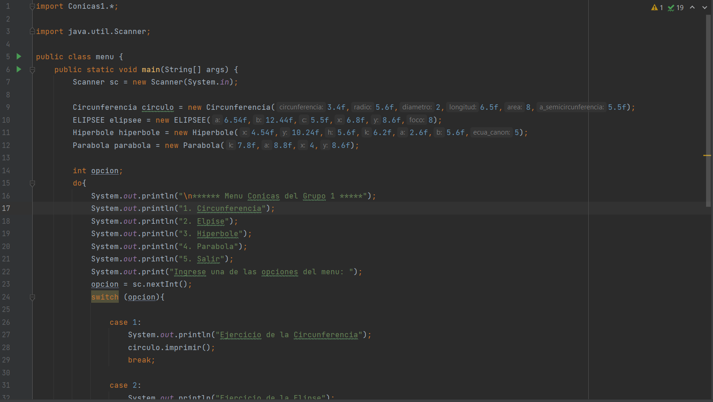
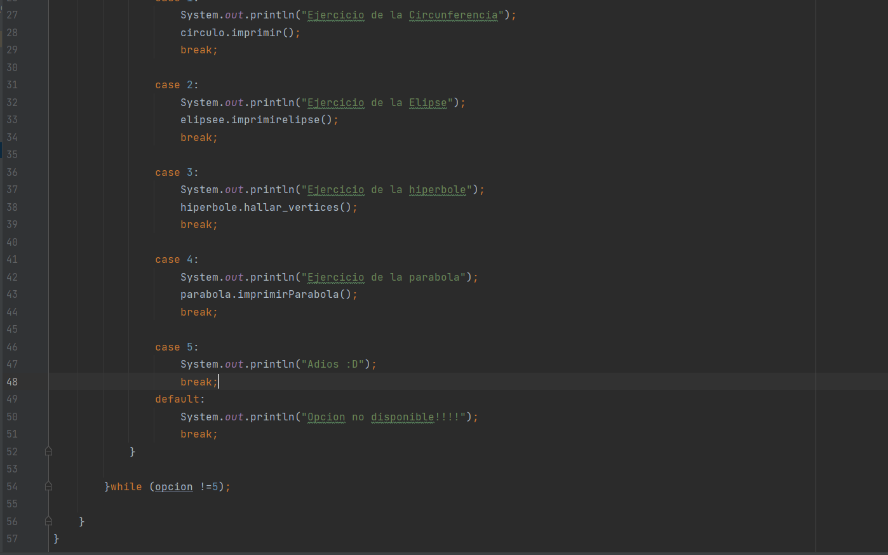
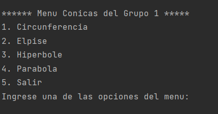
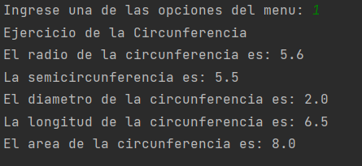
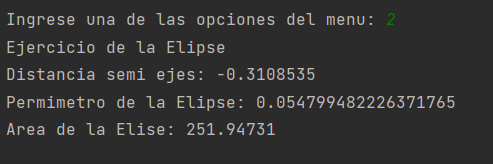
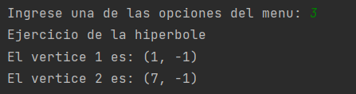
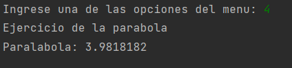

Juan falconi
## Instrucciones
Los miembros del equipo1 van a implementar un menú mostrando el uso e implementación de objetos del package del equipo2 y viceversa.

https://github.com/Mino-Mateo/Trabajo_Grupo_2.git

https://github.com/bryandelgado99/Conicas-1.git

Entregables: link del repositorio de GitHub con capturas de pantalla en el "README.md".

## Capturas del menu realizado:
    Menu Principal

    Resultados de la impresion en la consola:

    Circunferencia:

    Elipse:

    Hiperbole:

    Parabola:

